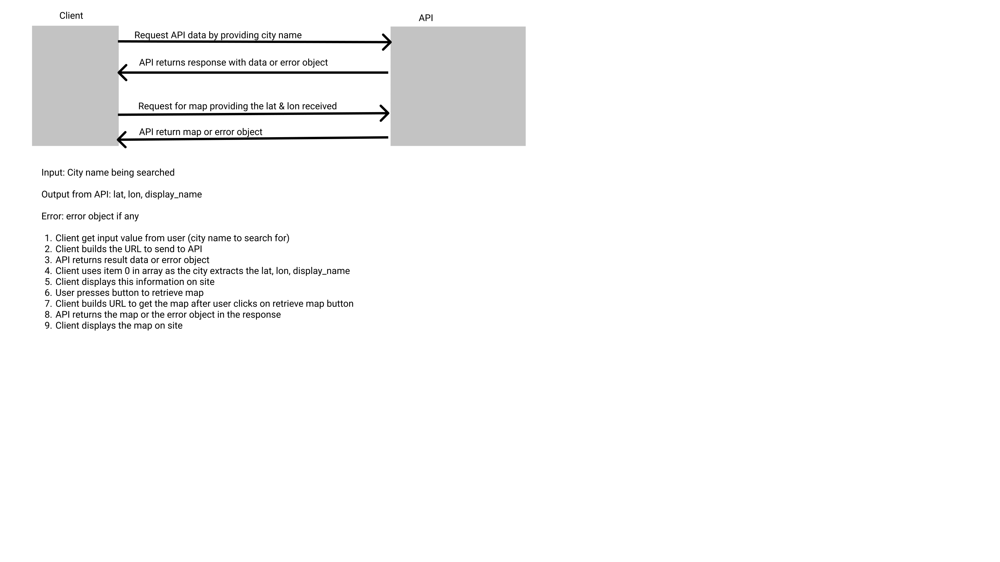
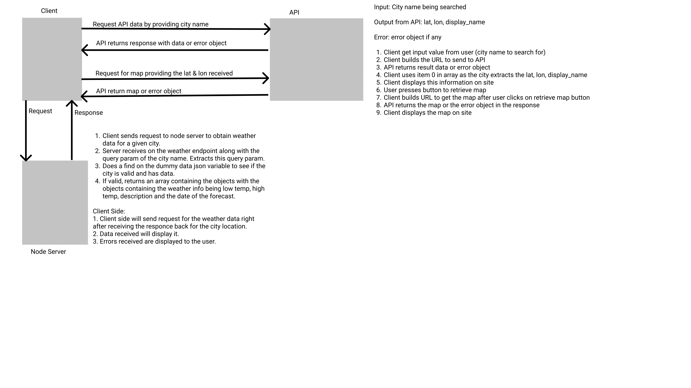

# City Explorer

**Author**: Willem Jacobs
**Version**: 1.0.6 (increment the patch/fix version number if you make more commits past your first submission)
**Deployed Site**: [Cick here to link to City Explorer](https://city-explorer-wamj.netlify.app/)
**Backend Server** [Click here to link to backend server](https://city-explorer-api-wamj.herokuapp.com)

## Overview

A site that allows you to enter a city and get back the coordinates of the city along with a full name. A show map button is available to display a map of that city. Uses the LocationIQ API to get the data required. Gets the 5 day forecast for the city searched. Also gets movies from API that shows moves with the city name in the title. Uses a deployed node.js server created on Heroku.com.

## Getting Started

- Clone from repo. [Link to Repo](https://github.com/Willem-Jacobs/city-explorer)
- `npm install` or `npm i` to install dependencies.
- `.env` file needed with the API key in it. `REACT_APP_CITY_KEY=<YOUR KEY VALUE INSERTED>` for LocationIQ.
- `REACT_APP_BACKEND_SERVER` in `.env` file for the backend server address to work.
- See the `sample.env` file for more information.

## Architecture

- Trello for Project Management
- React
- React Bootstrap & Bootstrap
- Axios
- LocationIQ [Link](https://locationiq.com/)
- Netlify - frontend client
- Heroky - backend server
- UML Lab-06 - 
- UML Lab-07 - 
- UML Lab-08 - 

## Change Log

07.27.2021 10:30am (V1.0.0) - Basic structure setup and deployed.

07.28.2021 1:30pm (v1.0.1) - Added form to allow entry of a city with a button to click that will submit the form. An API call is done to locationIQ to retrieve the data for that city. A card will display below the search button dislaying the city info (name/state/country/etc) along with the latitude and longitude of the city center. Error messages will show if some issue happens with the API call.

07.28.2021 10:45pm (v1.0.2) - Added feature to show a map based on city searched. Added styles and cards. Added some colors & button icons. Added clearing screen fatures.

7.28.2021 11:00pm (v1.0.3) - Error handling was completed for API requests.

7.31.2021 8:30pm (v1.0.4) - Added feature to pull weather for the selected city from a node backend.

08.04.2021 10:15pm (v1.0.5) - Lab 8 completion - Added weather searching from API and movie searching from API. Using private backend server instead of direct calls from client app. Request goes from client to backend then from backend to API servers and returns.

08.07.2021 02:54pm (v1.0.6) - Lab 9. Seperated the weather into a parent and child where the child shows the details. Seperated the movies into a parent and child component where the child will show the details. 2 modules created (Weather.js & Movie.js). Refactored code to use these 2 modules.

## Credit and Collaborations

No collaborations from others on this project.

### Feature 1 Trello Card #1

**Name of feature:** Basic structure setup and deployed

**Estimate of time needed to complete:** 1 hour

**Start time:** 09:30am

**Finish time:** 10:50am

**Actual time needed to complete:** 1:20 hour

### Feature 2 Trello Card #2

**Name of feature:** Get city info from API

**Estimate of time needed to complete:** 2 hours

**Start time:** 10:00am

**Finish time:** 1:30pm

**Actual time needed to complete:** 2 hours. Took a 1.5 hour break for lunch and some other things.

### Feature 3 Trello card #3

**Name of feature:** To show a map of the city searched

**Estimate of time needed to complete:** 1 hour

**Start time:** 09:00pm

**Finish time:** 10:45pm

**Actual time needed to complete:** 1:45 hours.

### Feature 4 Trello card #4

**Name of feature:** Error messages

**Estimate of time needed to complete:** 30 mins

**Start time:** 10:00am

**Finish time:** 1:30pm

**Actual time needed to complete:** 30 mins. This was done as I was working on the data retrieval part of the assignment from the API.

### Feature Lab-07 Trellow cards 2 & 3

**Name of feature:** Back-End Weather fetching

**Estimate of time needed to complete:** 3 hours

**Start time:** 2:00pm

**Finish time:** 8:30pm

**Actual time needed to complete:** 6:30 hours. I did take about 2 hours break time total reducing the code time to 4:30 hours. Still need to get some more items done but submitting for now and will work on the rest in the AM before lab is graded.

**Name of feature:** Back-End Weather from API and Movies from API

**Estimate of time needed to complete:** 1 hours

**Start time:** 9:00pm

**Finish time:** 10:00pm

**Actual time needed to complete:** 1 hour. Had more issues deploying and testing to ensure all worked correctly.

**Name of feature:** Trello Lab-09 card 2

**Estimate of time needed to complete:** 1 hours

**Start time:** 04:00pm

**Finish time:** 04:30pm

**Actual time needed to complete:** Way my code was structed, this was just a copy and past along with cutting out some code. I did use props desctructuring to make it easier.
